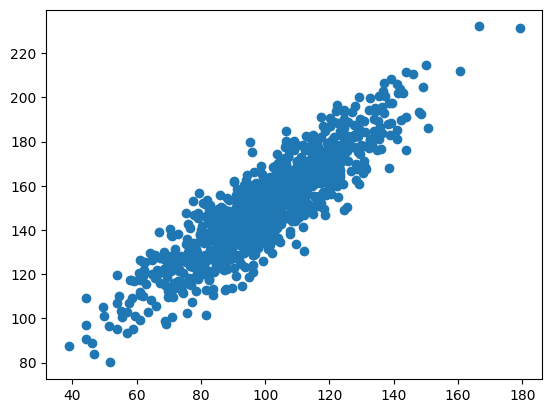
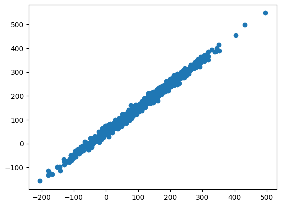
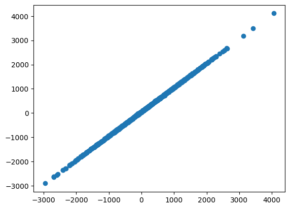

### Collaborative Discussion 1: The 4th Industrial Revolution

#### Initial Post

The topics discussed in Schwab's (2017) book on the fourth industrial revolution concern a sector I am involved in professionally - that is Big Data. Machine Learning and Artificial Intelligence cannot be created or work or exist or provide any value without the data that fuels them. It is fair to say that the significant advancements in ML and AI fields are made available thanks to the exponential increase in the data we collect globally, as humanity (Anon, 2022).

The availability of big data enables organisations to operate and scale more efficiently. With the increased reliance on data there is a growing risk of an incident with serious repercussions, should the data become unavailable, for whatever reason.

This brings me to a specific incident where information systems failed: the 2017 WannaCry ransomware attack (Julia Carrie Wong and Solon, 2017). This attack focused on encrypting organisations’ data and demanding a ransom in order for them to regain access. For private businesses this had widespread consequences that affected business continuity and resulted in monetary losses. Unfortunately also government organisations have been a target, with the UK’s NHS patients suffering, arguably, the most having thousands of their appointments cancelled and others having experienced disrupted patient care. This shows how important and crucial asset data is. By restricting access to it, malicious actors have caused pain and suffering - for NHS’s patients, monetary loss for businesses, disrupted usage of products of many companies (arguably the lowest level impact) by their customers and caused a significant reputational cost to all of the organisations affected. The failure of the systems that were hacked lays within the lack of proper cyber security measures that should have prevented attackers from gaining access to the data in the first place.

This example clearly proves that with great power, that big data gives us, huge responsibility comes. I like to think about it in a similar way one could think about household finances. The lower the number of streams of income, the higher reliance factor is associated with every single source of income, the higher risk of defaulting on household payments. If we, as humanity, continuously increase reliance on data and information systems - we must be prepared for an increased risk of “defaulting” on the delivery promised by these information systems.

References:

1. Schwab, K. (2017) The Fourth Industrial Revolution. London: Penguin Random House. 
2. Anon, (2022). Big Data And Artificial Intelligence: What’s The Future For Them? [online] Available at: https://dataconomy.com/2022/11/07/big-data-and-artificial-intelligence/?utm_content=cmp-true [Accessed 3 May 2023].
‌3. Julia Carrie Wong and Solon, O. (2017). Massive ransomware cyber-attack hits nearly 100 countries around the world. [online] the Guardian. Available at: https://www.theguardian.com/technology/2017/may/12/global-cyber-attack-ransomware-nsa-uk-nhs [Accessed 3 May 2023].

#### Summary Post

The discussion in this thread is focused on the significance of BigData in the 4th Industrial Revolution as well as on potential repercussions and security risks related to increased reliance on technology. It is clear to me how BigData is fueling advancements in Artificial Intelligence as well as in Machine Learning fields, and my colleagues seem to agree. With BigData come big responsibilities and only greater risks. The WannaCry ransomware attack being one of the examples where malicious actors caused a significant disruption to many businesses, but also for the UK’s National Health Service - which was particularly painful for the UK’s population. Many patients had their appointments cancelled or rescheduled as a result of these actions. One can only imagine what hardship must they have gone through, especially if waiting for a life-or-death kind of surgery. 

One of the points my initial post was challenged on is the comparison to household finances - when it comes to reliance on a single source of income (or truth - in case of data). It was found to be thought-provoking but required more context and explanation - which was supported in the reply. It was valuable learning for me, as this kind of comparison was self-explanatory to me, but I learned how important it is to make sure my communication is clear, as not everyone can work based on similar assumptions to myself. 

The summary of this discussion for me is the following: with BigData comes big responsibility. We are staying on the verge of a historical breakthrough that will increase the standard of living for so many people. But this opportunity comes at a hidden cost that we all must take into account. Putting protective measures in place, ensuring security of BigData, AI and ML should be at the top of the list of priorities. 

### e-Portfolio Activity: Correlation and Regression

When I started to look at the notebooks provided and I found my way around them, I realised very quickly that every change in data points can have an impact on correlation or regression. What caught my attention initially, was modifying the multiplier for the first data set, and as I was increasing the number, the correlation was flattening more and more. See below example:

 

 Figure 1: Initial Graph. 

 

 Figure 2: Graph where first variable had increased multiplier to 100. 

 

 Figure 3: Graph where first variable had increased multiplier to 1000. 

Further playing with data only brought more fun and interesting learnings. It has also prompted me to research a bit more on the topic.

As data is integral to statistical analysis and both correlation and regression are statistical ways of measurement - it only comes natural, that any change in them can have a profound impact on any analysis.

What I found to be detrimental to correlation is outliers. Because they deviate from the rest of the data significantly, they can also significantly impact the output of a correlation calculation (Ravichandran, 2009). Outlier, as the name suggests, is something that is out of order and does not fall into the usual behaviour of the data points. Which is why there are statistical best practices on how to identify and then exclude such points in order to run the correlation exercise correctly (Abhigyan, 2020).

When it comes to regression, I believe there is no need to repeat myself, as the effects are very similar to those on correlation. Outliers can seriously affect the regression line which in turn leads to incorrect interpretations (James et al., 2013). 

I have always believed that Data Science is a science of a “best-guess”. It is hard to imagine being 100% confident in any statistical analysis that one runs. It is because of that, that we must adhere to the best practices and all of the tools that statistics provides us with, so we can make sure that our best-guess is indeed the best-guess one can make. 

References:

1. Abhigyan (2020) Detecting and removing outliers., Medium. Available at: https://medium.com/analytics-vidhya/detecting-and-removing-outliers-7b408b279c9 (Accessed: 12 June 2023). 

2. Ravichandran, K. S. (2009). A First Course in Linear Model Theory. CRC Press.

3. James, G., Witten, D., Hastie, T., & Tibshirani, R. (2013). An Introduction to Statistical Learning: with Applications in R. Springer.

### Unit 4
### Unit 5

### Development Team Project: Project Report

At the end of Unit 6 we were due to submit the Development Team Project. I think the task was a very interesting one. We were asked to take a dataset from Airbnb publicly provided data, and try to answer an interesting question, that could be useful for the Airbnb's management team. We have asked ourselves: "Which feature most strongly affects the Airbnb listing
price?"

I, personally, have always found it fascinating, how prices for different services and products are developed. Is it the location, quality, size or maybe only inflation rate, that affects the change/amplitude in the prices across different services/products?

Working together with Rory was a huge learning experience for me. I found it extremely beneficial, that both of us have approach this task from different angles. In turn we could learn from each other as well as merge the results of our work into a coherent piece. 

Please find below the code we have used to answer the above set question:

'''python
# %% [markdown]
# # Airbnb Analysis

# %% [markdown]
# ## Data loading and preparation

# %%
import numpy as np
import pandas as pd
import scipy.stats as st
import matplotlib.pyplot as plt
import matplotlib.image as mpimg
import seaborn as sns
import missingno as msno
import warnings
warnings.filterwarnings('ignore')

# %%
airbnb=pd.read_csv('AB_NYC_2019.csv')

airbnb.fillna({'reviews_per_month':0,
              'name':'NA'}, inplace=True)

airbnb = airbnb[airbnb.price>0]

# %% [markdown]
# ### Exploratory Data Analysis: summary statistics including distribution

# %%
airbnb.describe()

# %%
airbnb.head()

# %%
airbnb.tail()

# %%
airbnb.shape

# %%
numeric_features = airbnb.select_dtypes(include=[np.number])
numeric_features.columns

# %%
categorical_features = airbnb.select_dtypes(exclude=[np.number])
categorical_features.columns

# %%
msno.matrix(airbnb.sample(250))

# %%
msno.dendrogram(airbnb)

# %%
sns.heatmap(airbnb.corr(method='kendall',
                  numeric_only=True), cmap='coolwarm')
plt.show()

# %% [markdown]
# ### Distribution of target (price)

# %%
sns.histplot(data=airbnb, x='price', binrange=(0,1000), bins=30)

# %%
airbnb['logprice'] = np.log2(airbnb.price)

# %%
sns.histplot(data=airbnb, x='logprice', bins=30)

# %% [markdown]
# ## Data processing
# 
# ### One hot encode categorical features

# %%
y = airbnb['logprice']

x = airbnb[['neighbourhood_group',
                   'latitude',
                   'longitude',
                   'room_type',
                   'minimum_nights',
                   'number_of_reviews',
                   'calculated_host_listings_count',
                   'availability_365']]

x_oh = pd.get_dummies(x, columns=['room_type','neighbourhood_group'])

# %% [markdown]
# ## Models
# 
# ### Imports for models

# %%
import sklearn
from sklearn.linear_model import LinearRegression
from sklearn.model_selection import train_test_split
from sklearn.metrics import r2_score
from sklearn.inspection import permutation_importance

# %% [markdown]
# ### 1. Linear regression

# %%
x_train,x_test,y_train,y_test=train_test_split(x_oh,y,test_size=.1,random_state=353)

model = LinearRegression()

model.fit(x_train,y_train)

# %%
y_pred=model.predict(x_train)
r2_score(y_train,y_pred)

# %%
y_pred=model.predict(x_test)
r2_score(y_test,y_pred)

# %%
importance = permutation_importance(model, x_test, y_test, scoring='neg_root_mean_squared_error').importances_mean

fig=sns.barplot(x=x_train.columns.tolist(), y=importance)
fig.set_title('Permutation importance of features in linear model')
fig.set_xticklabels(fig.get_xticklabels(), rotation=90)
plt.savefig('plots/perm_imp_linear.pdf', bbox_inches='tight')

# %% [markdown]
# ### 2. Decision tree regression

# %%
from sklearn.tree import DecisionTreeRegressor

model = DecisionTreeRegressor()

model.fit(x_train, y_train)

importance = model.feature_importances_

# %%
y_pred=model.predict(x_train)

r2_score(y_train,y_pred)

# %%
y_pred=model.predict(x_test)

r2_score(y_test,y_pred)

# %%
fig=sns.barplot(x=x_train.columns.tolist(), y=importance)
fig.set_title('GINI importance of features in decisiontree model')
fig.set_xticklabels(fig.get_xticklabels(), rotation=90)
plt.savefig('plots/gini_imp_dtree.pdf', bbox_inches='tight')

# %% [markdown]
# ### 3. Random forest regression

# %%
from sklearn.ensemble import RandomForestRegressor

model = RandomForestRegressor()

model.fit(x_train, y_train)

importance = model.feature_importances_

# %%
y_pred=model.predict(x_train)

r2_score(y_train,y_pred)

# %%
y_pred=model.predict(x_test)

r2_score(y_test,y_pred)

# %%
fig=sns.barplot(x=x_train.columns.tolist(), y=importance)
fig.set_title('GINI importance of features in RF model')
fig.set_xticklabels(fig.get_xticklabels(), rotation=90)
plt.savefig('plots/gini_imp_randforest.pdf', bbox_inches='tight')

# %%
importance = permutation_importance(model, x_test, y_test, scoring='neg_root_mean_squared_error').importances_mean

fig=sns.barplot(x=x_train.columns.tolist(), y=importance)
fig.set_title('Permutation importance of features in RF model (test)')
fig.set_xticklabels(fig.get_xticklabels(), rotation=90)
plt.savefig('plots/perm_imp_test_randforest.pdf', bbox_inches='tight')

# %%
importance = permutation_importance(model, x_train, y_train, scoring='neg_root_mean_squared_error').importances_mean

fig=sns.barplot(x=x_train.columns.tolist(), y=importance)
fig.set_title('Permutation importance of features in RF model (train)')
fig.set_xticklabels(fig.get_xticklabels(), rotation=90)
plt.savefig('plots/perm_imp_train_randforest.pdf', bbox_inches='tight')
plt.show()

# %% [markdown]
# ### 4. XGBoost regression

# %%
from xgboost import XGBRegressor

model = XGBRegressor()

model.fit(x_train, y_train)

importance = model.feature_importances_

# %%
y_pred=model.predict(x_train)

r2_score(y_train,y_pred)

# %%
y_pred=model.predict(x_test)

r2_score(y_test,y_pred)

# %%
fig=sns.barplot(x=x_train.columns.tolist(), y=importance)
fig.set_title('Inbuilt importance of features in XGBoost model (train)')
fig.set_xticklabels(fig.get_xticklabels(), rotation=90)
plt.savefig('plots/gini_imp_xgboost.pdf', bbox_inches='tight')

# %%
importance = permutation_importance(model, x_train, y_train, scoring='neg_root_mean_squared_error').importances_mean

fig=sns.barplot(x=x_train.columns.tolist(), y=importance)
fig.set_title('Permutation importance of features in XGBoost model (train)')
fig.set_xticklabels(fig.get_xticklabels(), rotation=90)
plt.savefig('plots/perm_imp_xgboost_train.pdf', bbox_inches='tight')

# %%
importance = permutation_importance(model, x_test, y_test, scoring='neg_root_mean_squared_error').importances_mean

# %%
fig=sns.barplot(x=x_train.columns.tolist(), y=importance)
fig.set_title('Permutation importance of features in XGBoost model (test)')
fig.set_xticklabels(fig.get_xticklabels(), rotation=90)
plt.savefig('plots/perm_imp_xgboost_test.pdf', bbox_inches='tight')

# %% [markdown]
# ## SHapley Additive exPlanations (SHAP)

# %%
import shap
shap.initjs()

x_train,x_test,y_train,y_test=train_test_split(x_oh,y,test_size=.1,random_state=353)

x_train_summary = shap.kmeans(x_train, 10)

# %% [markdown]
# ### 1. Linear regression SHAP

# %%
model = LinearRegression()

model.fit(x_train,y_train)

ex = shap.KernelExplainer(model.predict, x_train_summary)

shap_values = ex.shap_values(x_test[0:100])

shap.summary_plot(shap_values, x_test[0:100],show=False)
plt.savefig('plots/shap_linear_summary.pdf')

# %% [markdown]
# ### 2. Decision tree regression SHAP

# %%
from sklearn.tree import DecisionTreeRegressor

model = DecisionTreeRegressor()

model.fit(x_train, y_train)
ex = shap.TreeExplainer(model)
shap_values = ex.shap_values(x_test[0:200])
shap.summary_plot(shap_values, x_test[0:200],show=False)
plt.savefig('plots/shap_dtree_summary.pdf')

# %% [markdown]
# ### 3. XGBoost regression SHAP

# %%
from xgboost import XGBRegressor

model = XGBRegressor()

model.fit(x_train, y_train)

ex = shap.TreeExplainer(model)

shap_values = ex.shap_values(x_test[0:200])

shap.summary_plot(shap_values, x_test[0:200], show=False)
plt.savefig('plots/shap_xgboost_summary.pdf')
'''
### Unit 7
### Unit 8
### Unit 9
### Unit 10
### Unit 11
### Unit 12
